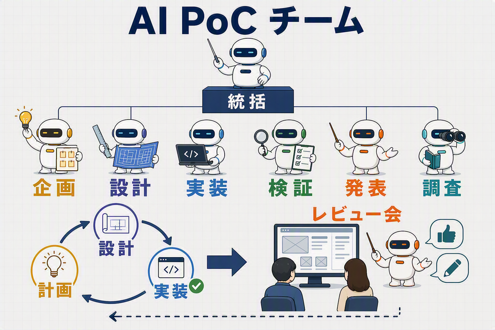

# AI Team Sample

AIエージェントを企画・設計・実装・検証・レビューの役割に分け、Web UI PoCを作成するためのサンプルです。

## 構成

- `.github/agents/`: エージェント定義
- `.github/skills/`: 各工程のスキル
- `.github/model-map-profiles/`: モデル設定例
- `.vscode/mcp.json`: Microsoft LearnとWorkIQのMCP設定

## 使い方

- `/execute-poc`を実行し、ヒアリングに回答すると、企画・設計・実装・動作確認を順に進めます。
- 成果物はルートの`poc-<PoC名>`に保存します。PoC成果物は全てGit管理対象外です。
- 子エージェントのモデルは、`.github/model-map.md`の`Active profile file`を変更して切り替えます。親セッションのモデルは変更されません。

## 注意

WorkIQはMicrosoft 365のメール、会議、ファイルなどにアクセスできるMCPです。使用しない場合は、`.vscode/mcp.json`の`workiq`設定を削除または無効化してください。使用する場合は、組織のポリシーとアクセス許可を確認してください。

## ライセンス

Apache License 2.0です。`.github/skills/playwright-cli/`には、[Microsoft Playwright](https://github.com/microsoft/playwright)から変更したドキュメントが含まれます。詳細は[NOTICE](NOTICE)を参照してください。
